# 1U Wheel Encoder THQWGD001 with Tatctile Button
([日本語 / detailed notes](https://note.com/taro_hayashi/n/nf608af2136d1))

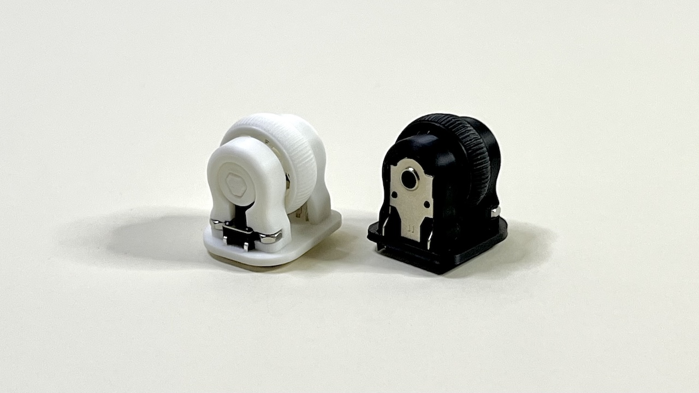

## Files
- https://github.com/Taro-Hayashi/THQWGD001/tree/main/step/THQWGD001C

> [!NOTE]
> Models are adjusted for 0.2mm nozzle.

<a property="dct:title" rel="cc:attributionURL" href="https://github.com/Taro-Hayashi/THQWGD001">THQWGD001C</a> by <a rel="cc:attributionURL dct:creator" property="cc:attributionName" href="https://x.com/w_vwbw">Taro Hayashi</a> is licensed under <a href="https://creativecommons.org/licenses/by/4.0/?ref=chooser-v1" target="_blank" rel="license noopener noreferrer" style="display:inline-block;">CC BY 4.0</a>

## Required

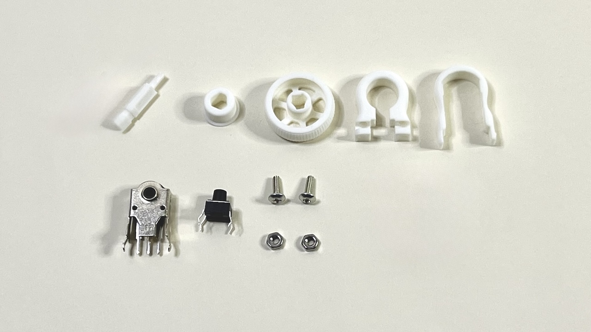

||||
|-|-|-|
|Shaft|1|THQWGD001C_shaft.stp|
|Spacer|1|THQWGD001C_spacer.stp|
|Wheel|1|THQWGD001C_wheel.stp|
|Base|1|THQWGD001C_base.stp|
|Cover|1|THQWGD001C_cover.stp|
|[Wheel Encoder](https://www.aliexpress.com/item/1005005353854113.html)|1|11mm|
|[Tactile Button](https://www.aliexpress.com/item/1005004045168083.html)|1|6x6x7mm|
|M2 screws|2|5mm or 6mm|
|M2 nuts|2||

### Assemble guide

- https://github.com/Taro-Hayashi/THQWGD001/tree/main/assemble_c.md

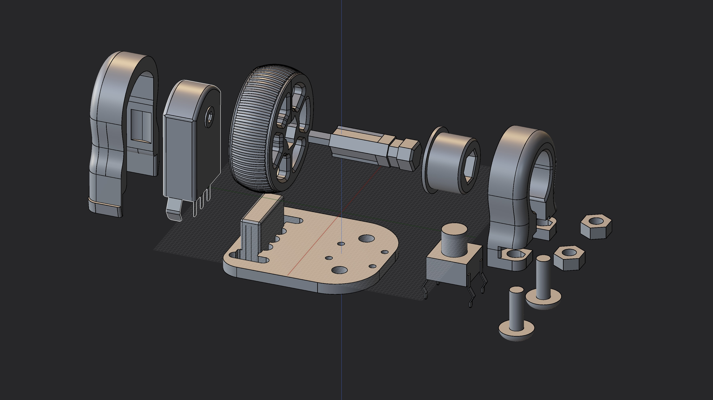

## Footprints and Symbol

- https://github.com/Taro-Hayashi/THQWGD001/tree/main/KiCad/8.0/

> [!NOTE]
> As clearance is required for mounting, use THQWGD001 (without a click) if two units are to be placed side by side in the same direction

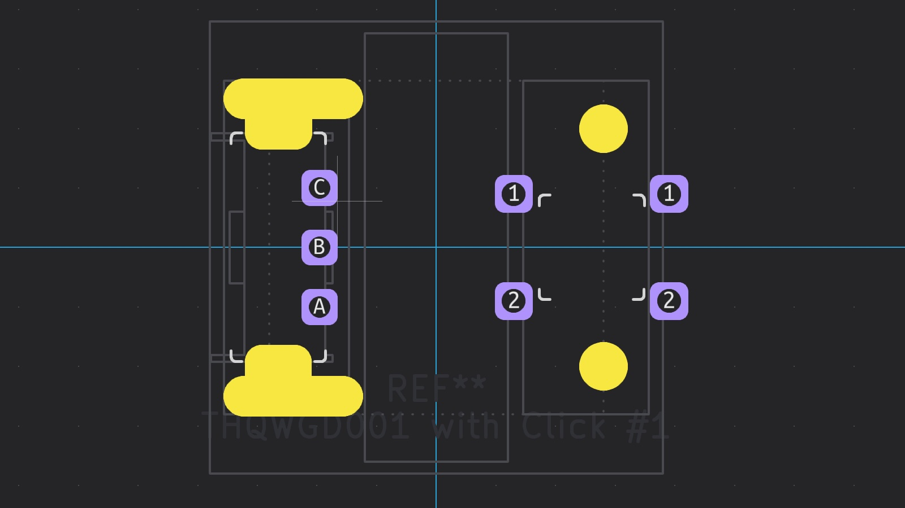

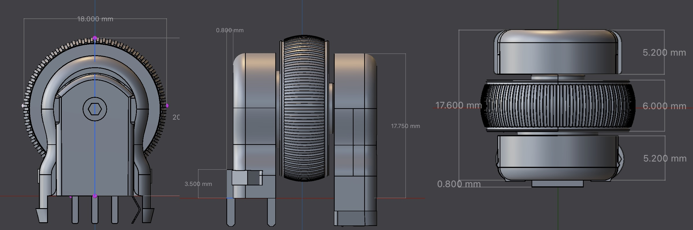

# 1U Wheel Encoder THQWGD001

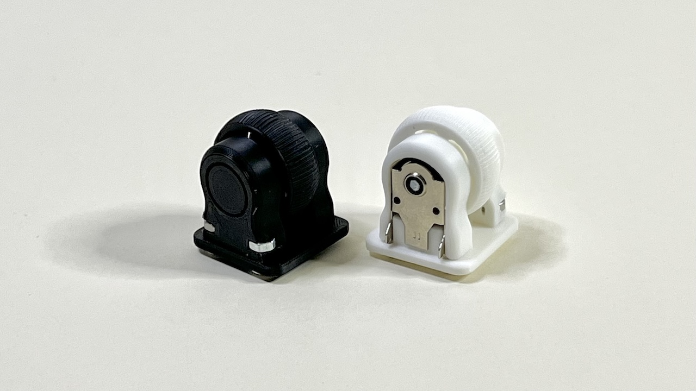

## Files

- GitHub https://github.com/Taro-Hayashi/THQWGD001/tree/main/step/THQWGD001
- Printables https://www.printables.com/model/949835-1u-wheel-encoder-thqwgd001
- Maker World https://makerworld.com/en/models/550355#profileId-468693

> [!NOTE]
> Models are adjusted for 0.2mm nozzle.

<a property="dct:title" rel="cc:attributionURL" href="https://github.com/Taro-Hayashi/THQWGD001">THQWGD001</a> by <a rel="cc:attributionURL dct:creator" property="cc:attributionName" href="https://x.com/w_vwbw">Taro Hayashi</a> is licensed under <a href="https://creativecommons.org/licenses/by/4.0/?ref=chooser-v1" target="_blank" rel="license noopener noreferrer" style="display:inline-block;">CC BY 4.0</a>

## Required

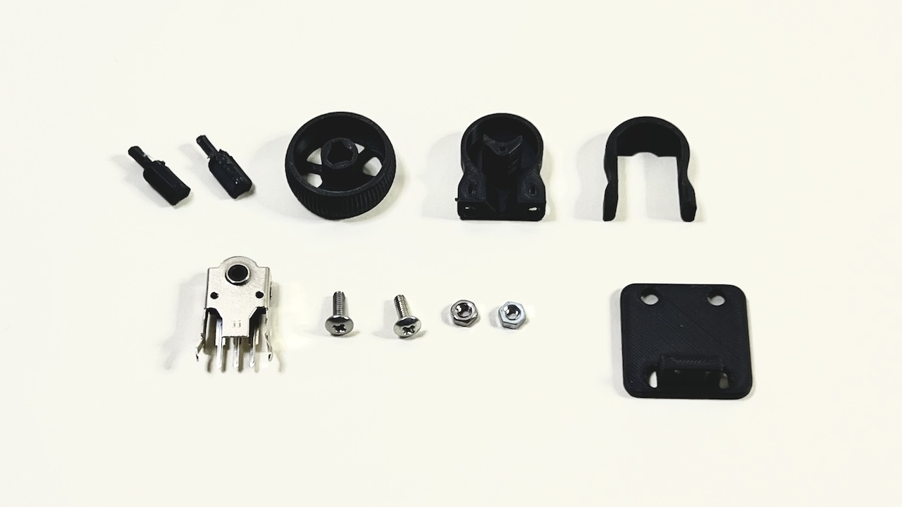

||||
|-|-|-|
|Wheel|1|THQWGD001_wheel.stp|
|Shaft|1|THQWGD001_shaft.stp|
|Base|1|THQWGD001_base.stp|
|Cover|1|THQWGD001_cover.stp|
|[Wheel Encoder](https://www.aliexpress.com/item/1005005353854113.html)|1|11mm|
|M2 screws|2|5mm or 6mm|
|M2 nuts|2||

### Assemble guide
- https://github.com/Taro-Hayashi/THQWGD001/tree/main/assemble.md

## Footprints and Symbol
- https://github.com/Taro-Hayashi/THQWGD001/tree/main/KiCad/8.0/

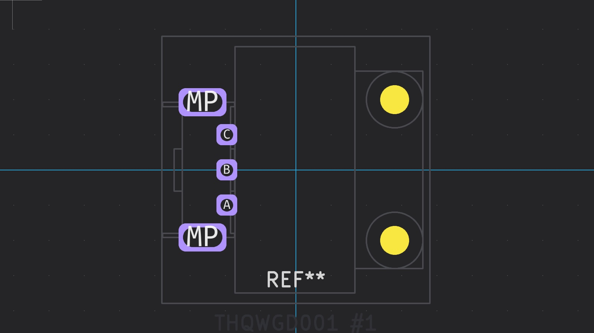

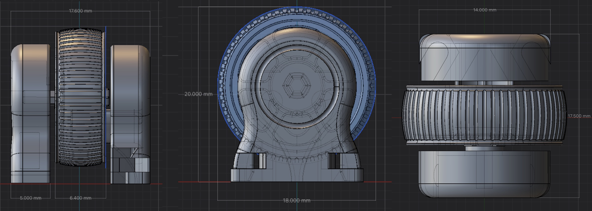

# PCB Sample
- https://github.com/Taro-Hayashi/THQWGD001/tree/main/PCB_sample
  
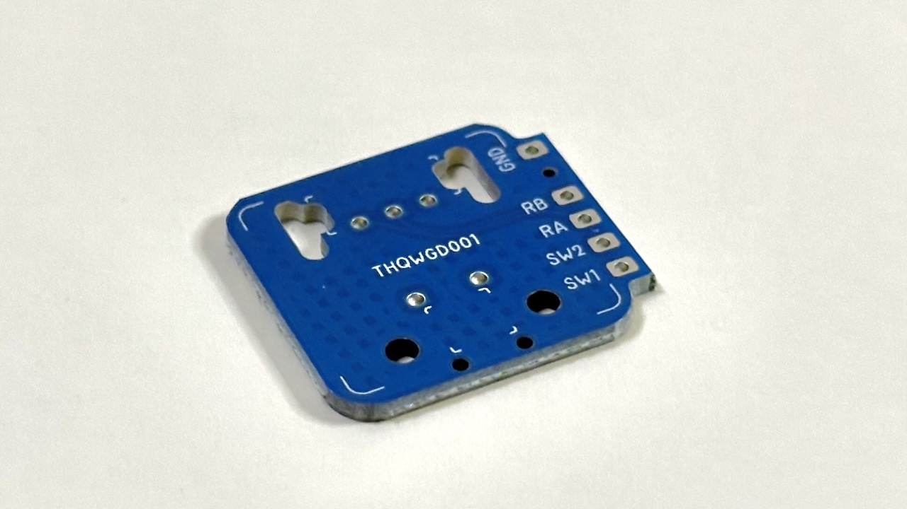
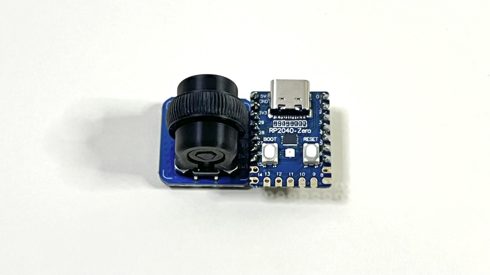

# BOOTH
https://tarohayashi.booth.pm/items/5967252
