# 1U Wheel Encoder THQWGD001

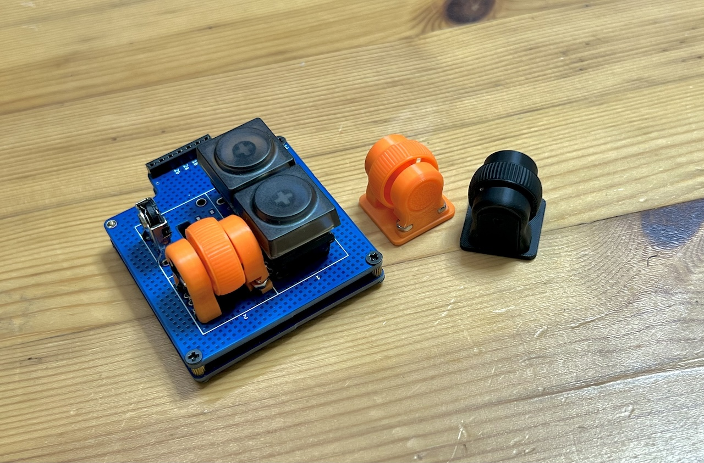

## Required

||||
|-|-|-|
|THQWGD001 Shaft|1||
|THQWGD001 Wheel|1||
|THQWGD001 Base|1||
|Wheel Encoder|1|11mm|
|M2 screws|2|5mm or 6mm|
|M2 nuts|2||

## Optional
|||
|-|-|
|THQWGD001 cover|1||
|Board sample|1||

## KiCad footprint
- https://github.com/Taro-Hayashi/THQWGD001/tree/main/KiCad

### PCB Sample

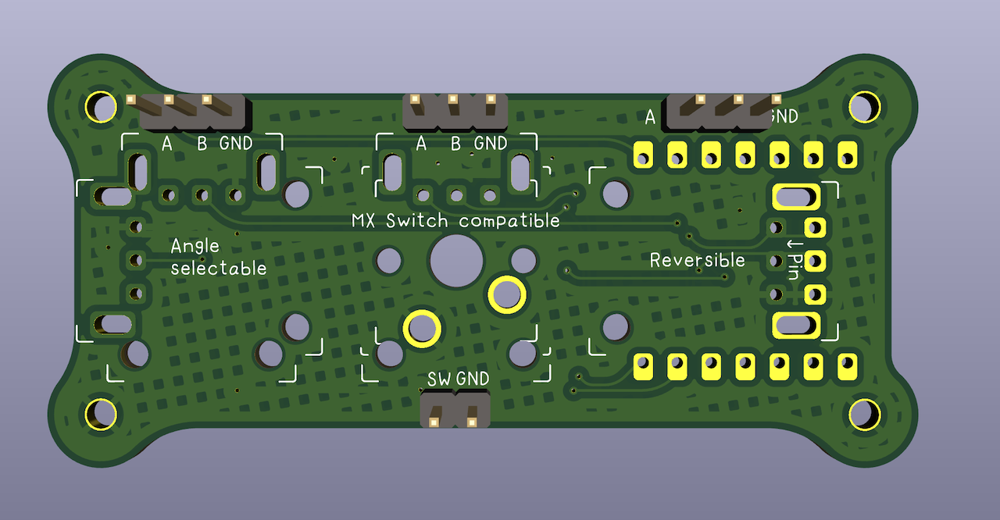

## STL
- Github(here) https://github.com/Taro-Hayashi/THQWGD001/tree/main/stl
- Maker World 
- Printables 
- Thingiverse 
- Cult3D 
- PrusaPrinters 
- Instructables 
- CGTrader 
- Gumroad 
- Thangs 
- CREALITY CLOUD
  
### Confirmed settings

|Printer|Nozzle|Preset||
|-|-|-|-|
|Bambu Lab P1S|0.2 mm|0.10mm Standard @BBL P1P 0.2 nozzle|Sanding to the shaft is required.|
|Bambu Lab P1S|0.4 mm|0.12mm Fine @BBL X1C|Sanding to the shaft and support marks is required.|

> [!NOTE]
> Slowing down the printing speed will print more nicely.
  

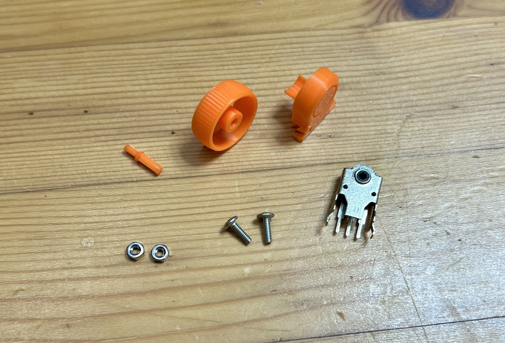
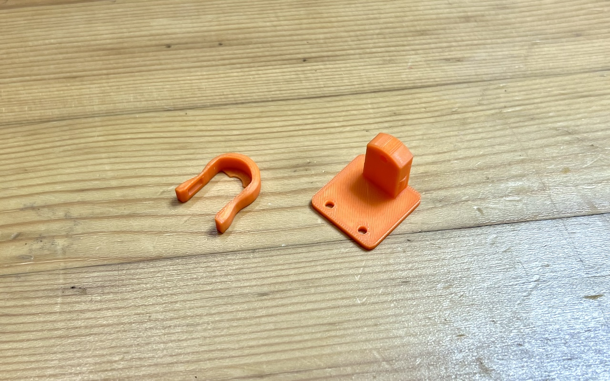
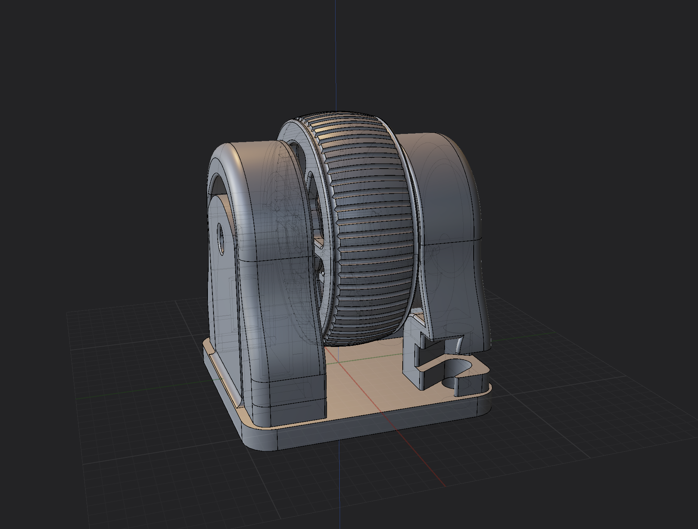
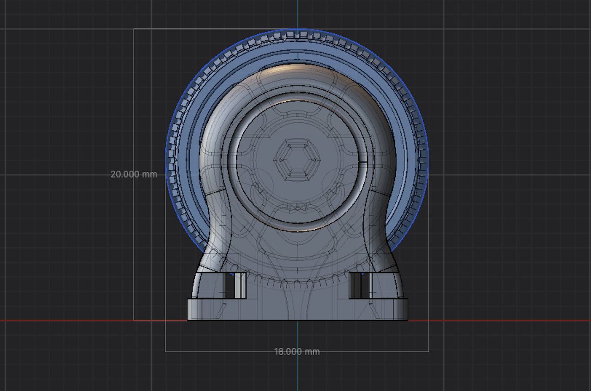
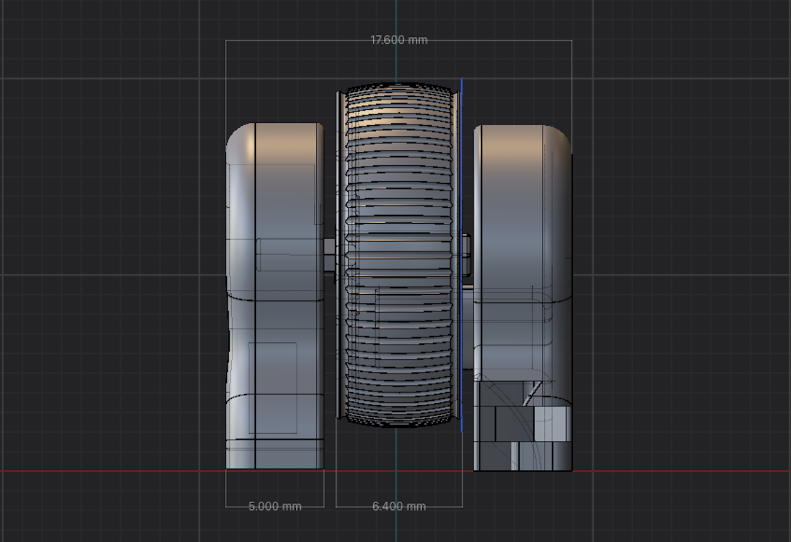
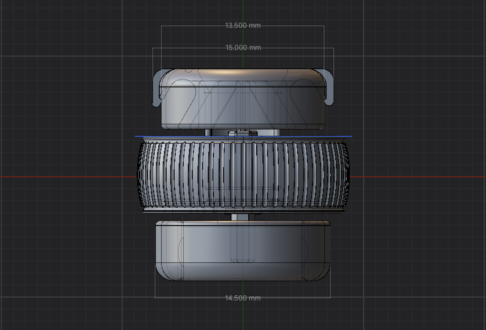
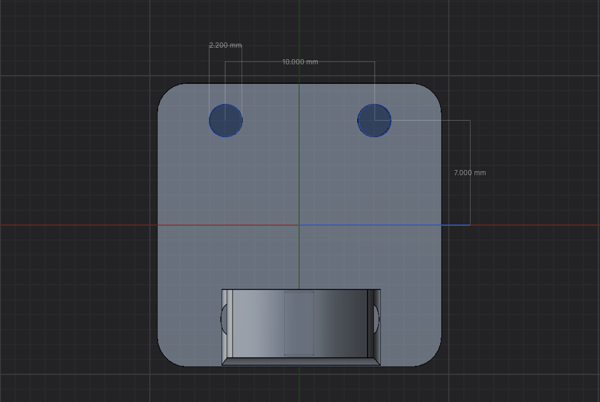

<a property="dct:title" rel="cc:attributionURL" href="https://github.com/Taro-Hayashi/THQWGD001">THQWGD001</a> by <a rel="cc:attributionURL dct:creator" property="cc:attributionName" href="https://x.com/w_vwbw">Taro Hayashi</a> is licensed under <a href="https://creativecommons.org/licenses/by/4.0/?ref=chooser-v1" target="_blank" rel="license noopener noreferrer" style="display:inline-block;">CC BY 4.0</a>

    

# Wheel for Killer Whale

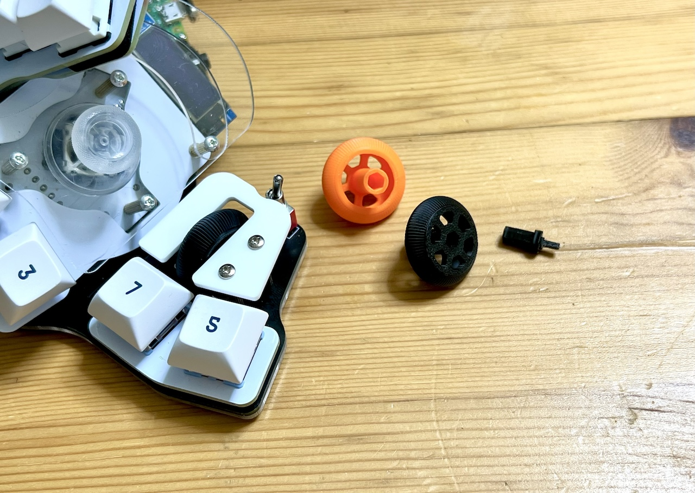
# Required
||||
|-|-|-|
|Shaft|1||
|Wheel|1||
|Wheel Encoder|1|11mm|
|M2 screws|3|
|M2 Spacer|1|8mm|
|M2 Spacers|2|D = 3.3, H = more than 12mm|

## KiCad footprint
- https://github.com/Taro-Hayashi/THQWGD001/tree/main/KiCad

## STL
- Github(here) https://github.com/Taro-Hayashi/THQWGD001/tree/main/stl
- MAker World 
- Printables 
- Thingiverse 
- Cult3D 
- PrusaPrinters 
- Instructables 
- CGTrader 
- Gumroad 
- Thangs 
- CREALITY CLOUD 

## 
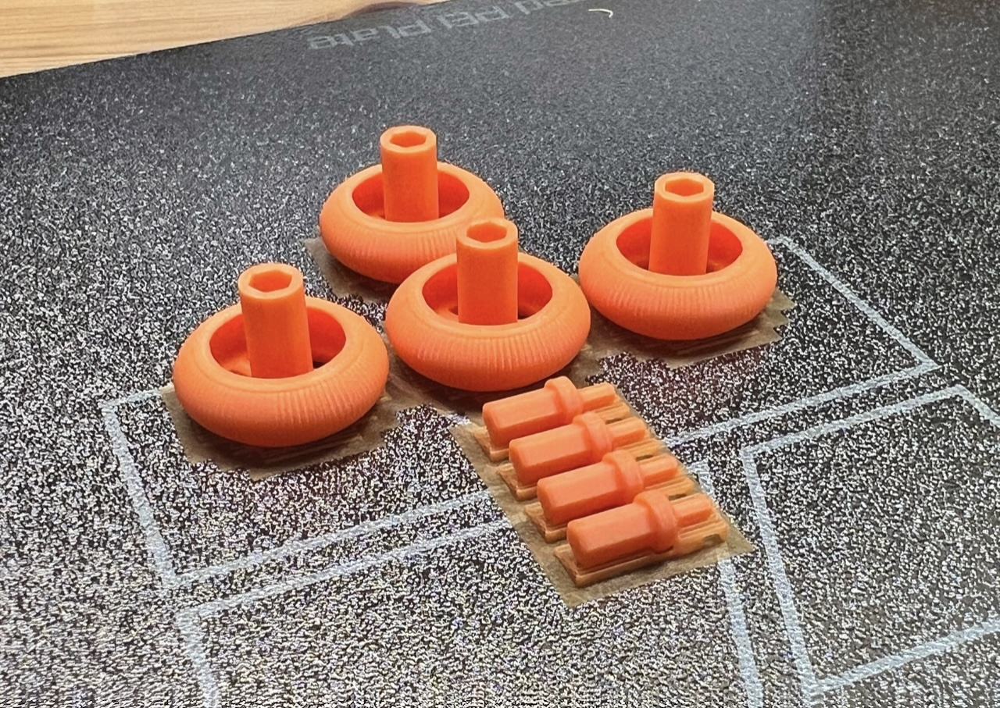
