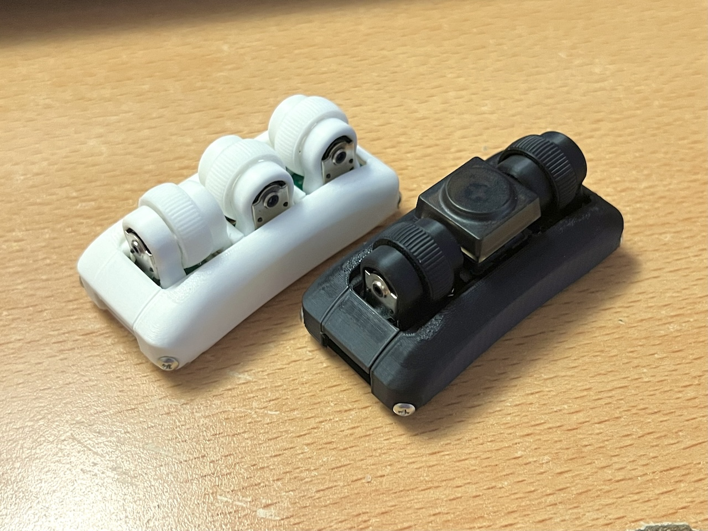
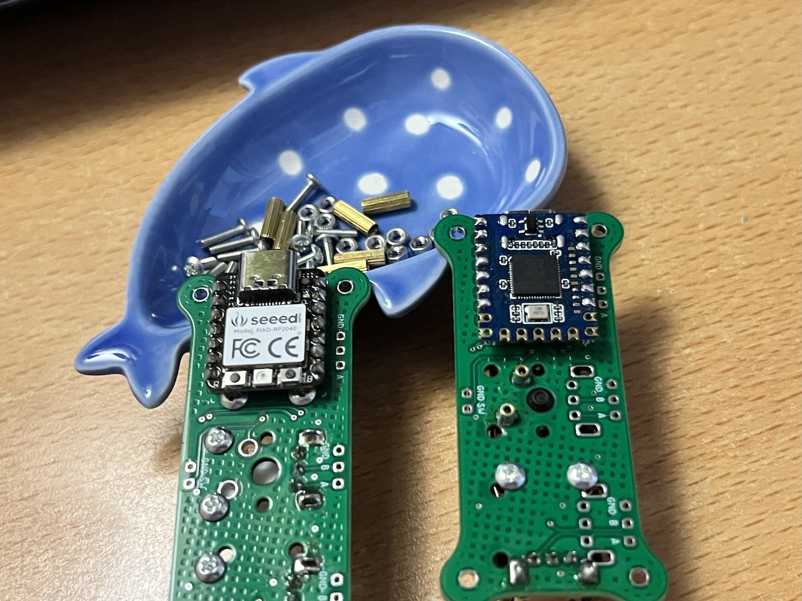
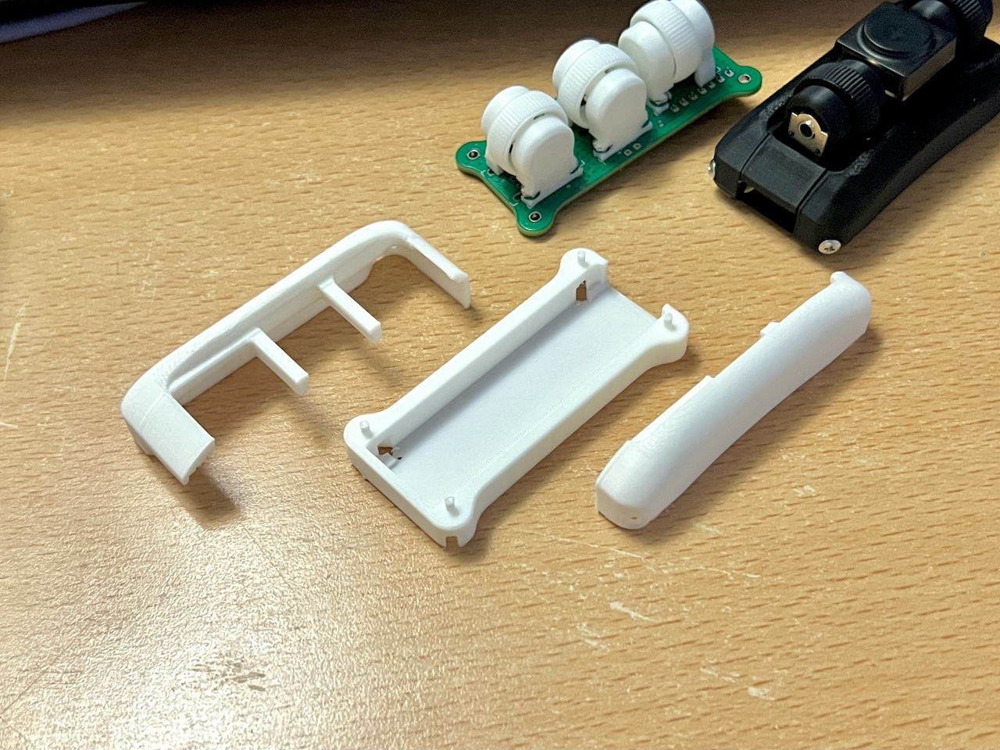
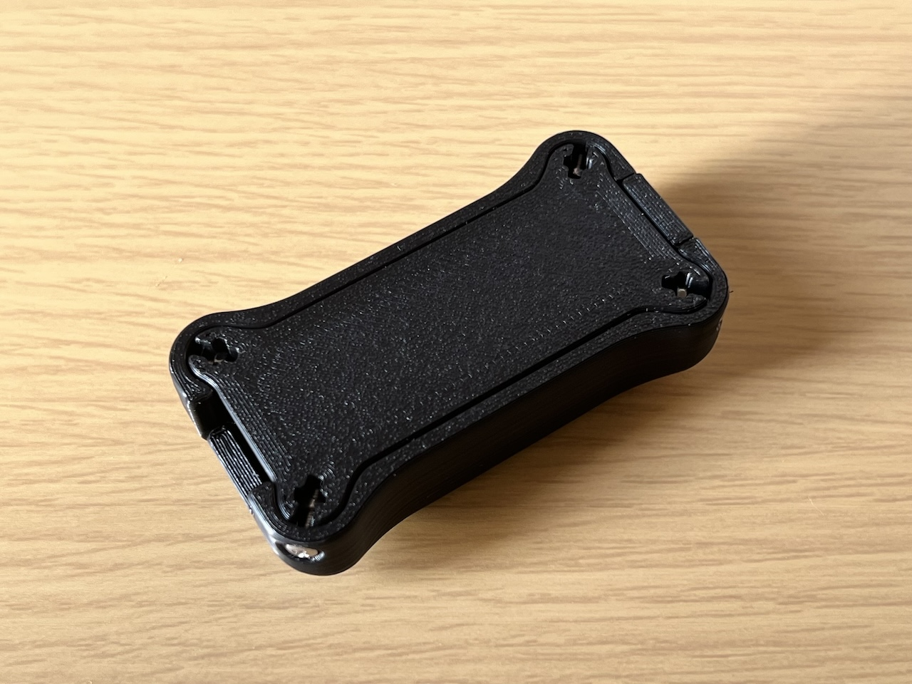
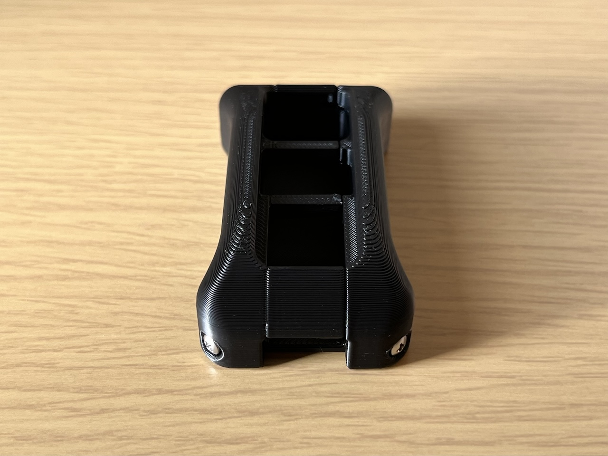
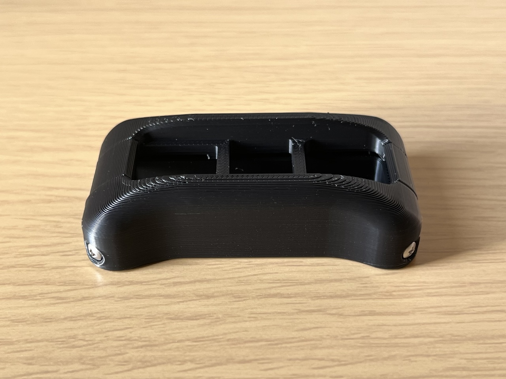

# 1U Wheel Encoder THQWGD001

## STL
- Github https://github.com/Taro-Hayashi/THQWGD001/tree/main/stl
- Printables https://www.printables.com/model/949835-1u-wheel-encoder-thqwgd001
- Maker World https://makerworld.com/en/models/550355#profileId-468693

<a property="dct:title" rel="cc:attributionURL" href="https://github.com/Taro-Hayashi/THQWGD001">THQWGD001</a> by <a rel="cc:attributionURL dct:creator" property="cc:attributionName" href="https://x.com/w_vwbw">Taro Hayashi</a> is licensed under <a href="https://creativecommons.org/licenses/by/4.0/?ref=chooser-v1" target="_blank" rel="license noopener noreferrer" style="display:inline-block;">CC BY 4.0</a>

### Confirmed settings

|Printer|Nozzle|Layer|
|-|-|-|
|Bambu Lab P1S|0.2 mm|0.10mm|
|Bambu Lab P1S|0.4 mm|0.20mm|

## Required

||||
|-|-|-|
|THQWGD001 Shaft|1|THQWGD001_shaft.stl|
|THQWGD001 Wheel|1|THQWGD001_wheel.stl|
|THQWGD001 Base|1|THQWGD001_base.stl|
|Wheel Encoder|1|11mm|
|M2 screws|2|5mm or 6mm|
|M2 nuts|2||

> [!NOTE]
> Shaft should be printed horizontally for durability.

## Optional
||||
|-|-|-|
|THQWGD001 cover|1|THQWGD001_cover.stl|

## KiCad footprint
- https://github.com/Taro-Hayashi/THQWGD001/tree/main/KiCad

### PCB Sample

Firmware
- https://github.com/Taro-Hayashi/THQWGD001/releases/download/1.1/tarohayashi_thqwgd001_xiaorp2040_vial.uf2
- https://github.com/Taro-Hayashi/THQWGD001/releases/download/1.1/tarohayashi_thqwgd001_rp2040zero_vial.uf2

> [!CAUTION]
> When using RP2040-Zero, pin headers or pin sockets must be at least 3.5 mm high.

code
- https://github.com/Taro-Hayashi/qmk_firmware/tree/tarohayashi/keyboards/tarohayashi/thqwgd001
- https://github.com/Taro-Hayashi/vial-qmk/tree/tarohayashi/keyboards/tarohayashi/thqwgd001

### Case
- Github https://github.com/Taro-Hayashi/THQWGD001/tree/main/stl

> [!WARNING]
> When using this case, attach the XIAO RP2040 with a 2.5mm high pin header or similar.

### Photos

### BOOTH
https://tarohayashi.booth.pm/items/5967252
