# THQWGD001C Assemble Guide

Remove the support from the shaft.
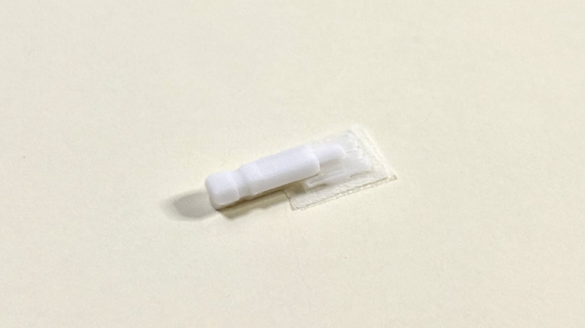

Shape with a file.
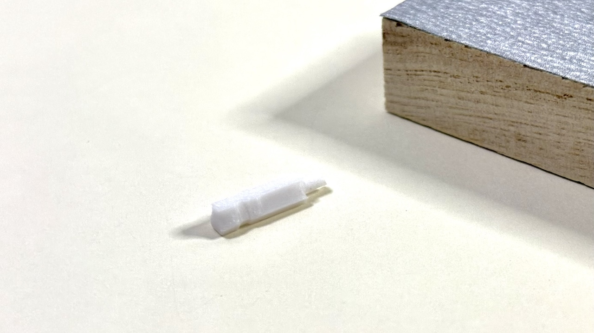

Align with the hexagonal hole in the encoder.
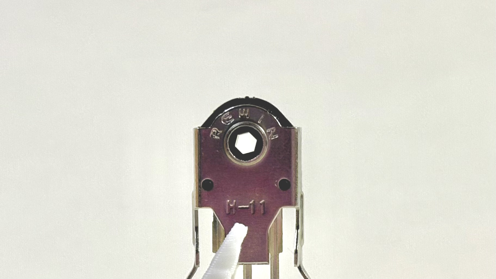

Be careful not to sand too much.
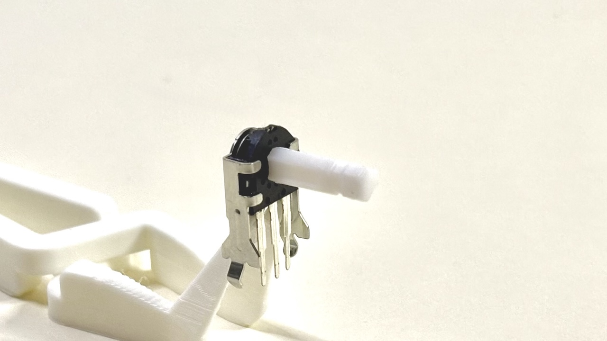

> [!NOTE]
> Shaft I sell on BOOTH have been done up to this point.

Attach the axle to the wheel.
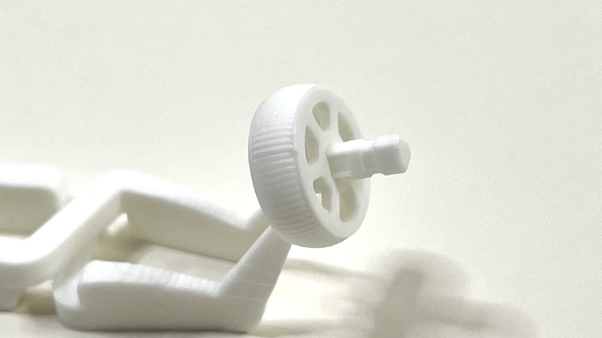

Attach wheel to encoder.
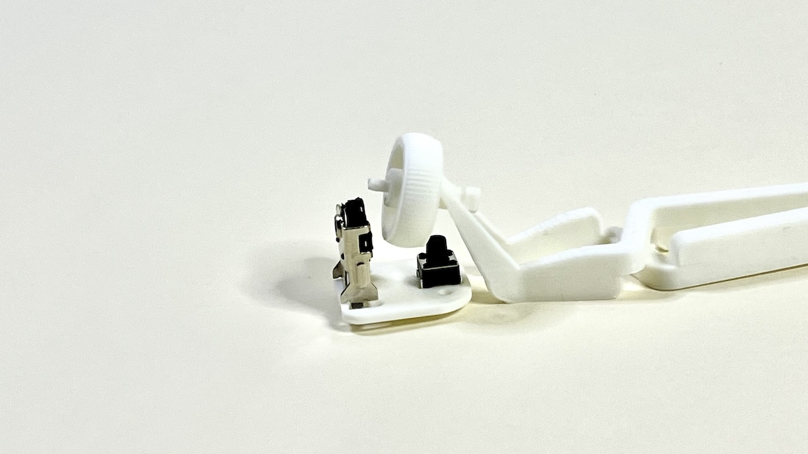

When inserting, it is easier to pull the shaft out slightly.
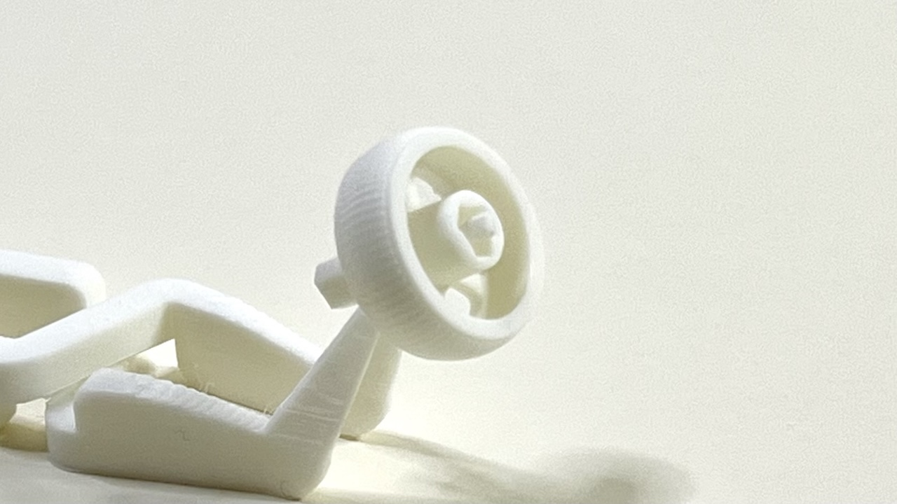

The shaft stops here, so be careful not to push it in too far.
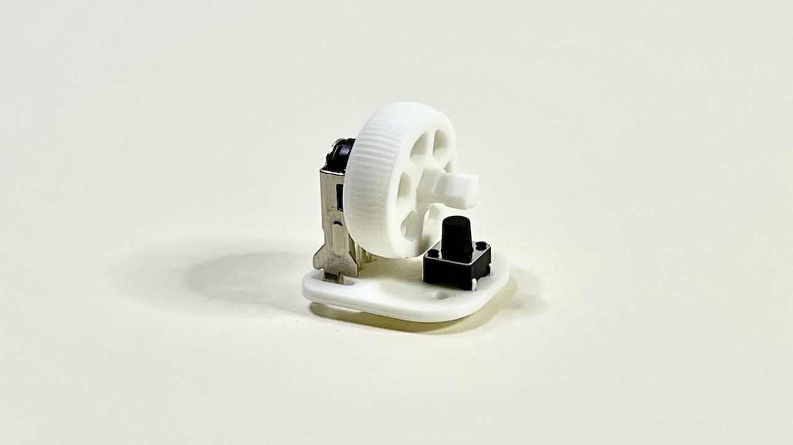

Attach the spacer at the end of the shaft.
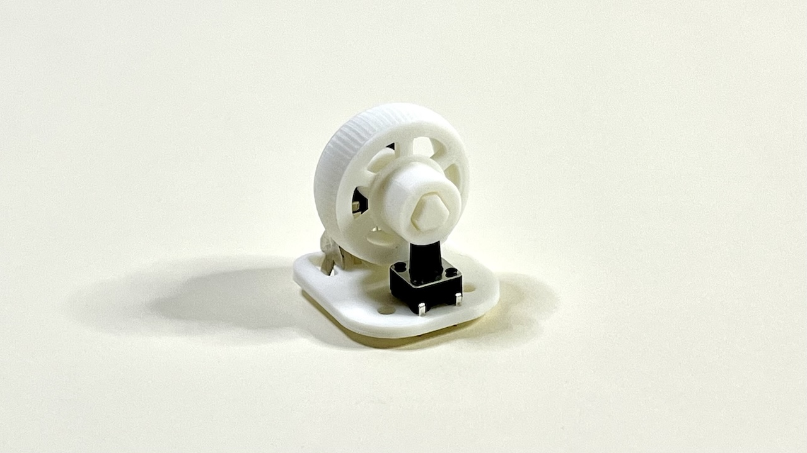

Attach the base with screws and nuts.
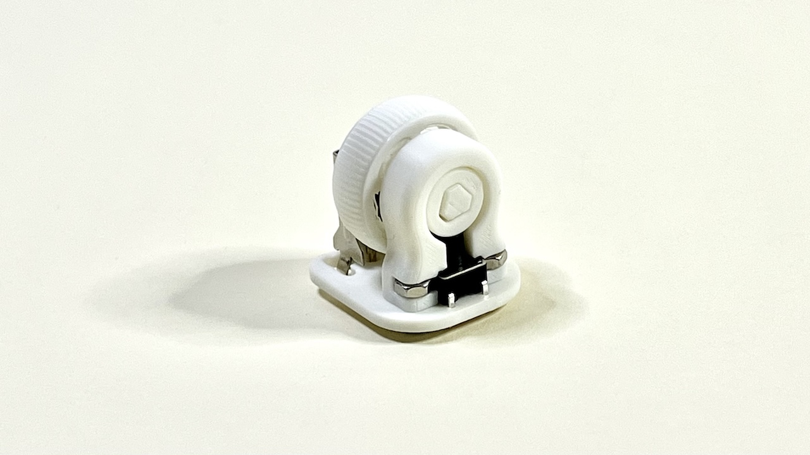

Attach the cover over the encoder.
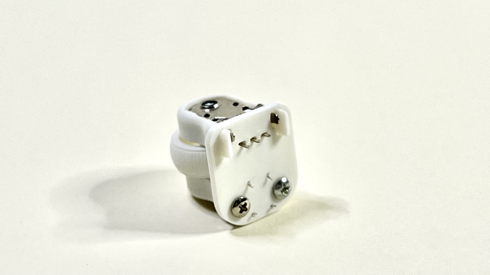

Completion.
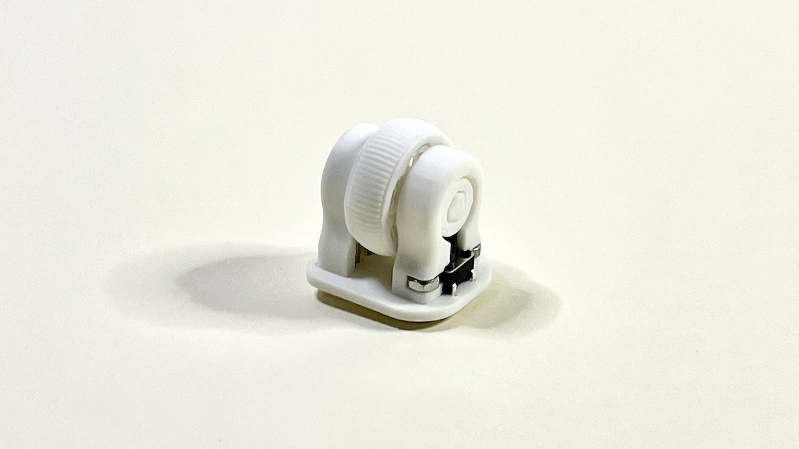
